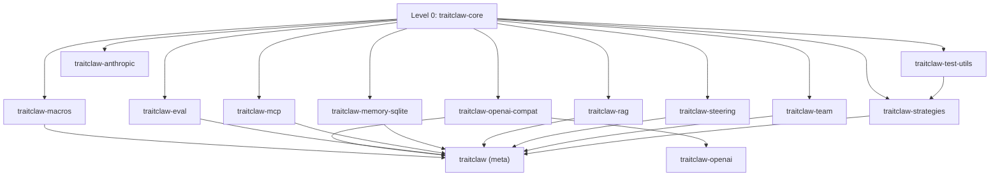

---
stepsCompleted:
  - step-01-init
  - step-02-context
  - step-03-starter
  - step-04-decisions
  - step-05-patterns
  - step-06-structure
  - step-07-validation
  - step-08-complete
inputDocuments:
  - prd-v1.0.0.md
  - architecture.md
  - architecture-v0.9.0.md
  - product-brief-traitclaw-2026-03-26.md
workflowType: 'architecture'
project_name: 'traitclaw'
user_name: 'Bangvu'
date: '2026-03-28'
status: 'complete'
completedAt: '2026-03-28'
---

# Architecture Decision Document — TraitClaw v1.0.0

_This document covers the architectural decisions for the v1.0.0 "Production Ready" stabilization release._

---

## Project Context Analysis

### Requirements Overview

TraitClaw v1.0.0 is a **packaging and stabilization release** — zero new features, zero API changes. The architectural scope is:

**Functional Requirements (19 FRs across 5 areas):**

- **API Freeze (FR1-3):** Version bump to 1.0.0, workspace synchronization, no public API changes
- **Ecosystem Packaging (FR4-8):** README, CHANGELOG, LICENSE, CONTRIBUTING, Cargo.toml metadata
- **docs.rs Configuration (FR9-11):** Metadata config, module docs, crate-level links
- **crates.io Publication (FR12-14):** Dry-run, ordered publish, rendering verification
- **Policy Documentation (FR15-19):** Semver, MSRV, deprecation, roadmap

**Non-Functional Requirements (5 NFRs):**

- NFR1: Build performance unchanged
- NFR2: Documentation quality (missing_docs, no broken links)
- NFR3: Package quality (no leaked files, < 1MB per crate)
- NFR4: Ecosystem standards (dual license, Keep a Changelog)
- NFR5: CI readiness (dry-run as CI step)

### Scale & Complexity

- **Complexity level:** Medium (coordination, not engineering)
- **Primary challenge:** Multi-crate publish ordering and metadata consistency
- **Risk area:** crates.io name availability and cross-crate version resolution

### Technical Constraints

1. All 14 crates must use `version.workspace = true` — single version source
2. Publish order must respect dependency graph (4 levels)
3. No new runtime dependencies — metadata and docs only
4. MSRV 1.75 locked in workspace `Cargo.toml`
5. Dual license MIT OR Apache-2.0 (Rust ecosystem convention)

---

## Starter Template Evaluation

**N/A** — brownfield project. No new scaffolding needed.

### Existing Foundation

```
Workspace: 14 crates, 23 examples, ~23,700 LoC, 649+ tests
Edition: Rust 2021, MSRV 1.75
Runtime: tokio 1.x (full features)
CI: fmt + clippy + test + docs
```

All architectural foundations are already in place from v0.1–v0.9. This release adds no structural changes.

---

## Core Architectural Decisions

### AD1: Version Strategy — Synchronized Workspace Version

**Decision:** All 14 crates share a single version number `1.0.0` via `version.workspace = true`.

**Rationale:**
- Users expect `traitclaw = "1.0"` to pull compatible versions of all sub-crates
- Independent versioning creates confusion for a tightly-coupled workspace
- Workspace version field already exists — no new mechanism needed

**Alternatives Considered:**
- Independent crate versions (rejected: complexity, version matrix confusion)
- Core-only v1.0, sub-crates stay v0.x (rejected: signals instability)

### AD2: Publish Strategy — Topological Order with Dry-Run Gate

**Decision:** Publish in strict dependency order with `cargo publish --dry-run` as a prerequisite gate.

**Publish Order (4 levels):**



**Exact publish sequence:**

```bash
# Level 0 — no internal deps
cargo publish -p traitclaw-core

# Level 1 — depends on core only
cargo publish -p traitclaw-test-utils
cargo publish -p traitclaw-macros
cargo publish -p traitclaw-openai-compat
cargo publish -p traitclaw-anthropic
cargo publish -p traitclaw-eval
cargo publish -p traitclaw-mcp
cargo publish -p traitclaw-memory-sqlite
cargo publish -p traitclaw-rag
cargo publish -p traitclaw-steering
cargo publish -p traitclaw-team

# Level 2 — depends on core + another L1 crate
cargo publish -p traitclaw-openai        # depends on openai-compat
cargo publish -p traitclaw-strategies    # depends on test-utils

# Level 3 — meta-crate depends on all
cargo publish -p traitclaw
```

**Rationale:**
- crates.io requires all dependencies to exist before publish
- Dry-run catches missing metadata before real publish
- Sequential publish avoids race conditions on crates.io index

### AD3: License Strategy — Dual License with Physical Files

**Decision:** Dual license MIT OR Apache-2.0 with physical `LICENSE-MIT` and `LICENSE-APACHE` files at repository root.

**Rationale:**
- Rust ecosystem de facto standard (used by serde, tokio, rand, etc.)
- `Cargo.toml` already has `license = "MIT OR Apache-2.0"`
- crates.io requires license files to be present in the package
- Physical files needed for legal compliance in enterprise environments

### AD4: README Strategy — Single Source, Crate-Specific

**Decision:**
- Root `README.md` — full README with badges, quickstart, feature matrix, architecture, roadmap
- Each sub-crate gets a minimal `README.md` with: crate description, link to main README, link to docs.rs
- Meta-crate `README.md` — same as root README (symlink or copy)

**Rationale:**
- crates.io shows the crate's own README, not the workspace root
- Sub-crate READMEs should direct users to the main project, not duplicate content
- Meta-crate is the primary entry point on crates.io

### AD5: Cargo.toml Metadata Standard

**Decision:** Every crate's `Cargo.toml` includes these fields:

```toml
[package]
name = "traitclaw-{name}"
version.workspace = true
edition.workspace = true
rust-version.workspace = true
license.workspace = true
repository.workspace = true
description = "{one-line description}"
readme = "README.md"
keywords = ["ai", "agent", "llm", "framework", "{crate-specific}"]
categories = ["api-bindings", "asynchronous"]

[package.metadata.docs.rs]
all-features = true
rustdoc-args = ["--cfg", "docsrs"]
```

**Rationale:**
- Workspace inheritance for shared fields minimizes duplication
- `keywords` limited to 5 (crates.io requirement)
- `categories` from official crates.io taxonomy
- `docs.rs` metadata enables feature-gated docs rendering

### AD6: CHANGELOG Format — Keep a Changelog

**Decision:** Use [Keep a Changelog](https://keepachangelog.com/) format, single file at repo root.

**Structure:**
```markdown
# Changelog

## [1.0.0] - 2026-03-XX
### Changed
- API stabilized — semver guarantee begins
### Added
- README with quickstart, feature matrix, architecture
- CHANGELOG, LICENSE, CONTRIBUTING
- crates.io metadata for all crates
- Post-v1.0 roadmap (v1.1–v1.3)

## [0.9.0] - 2026-03-28
### Removed
- `ContextStrategy` trait and all implementations
- `OutputProcessor` trait and all implementations
...
```

**Rationale:**
- Standard format recognized by tools (`cargo-release`, `release-drafter`)
- Single file avoids per-crate changelog fragmentation
- Covers complete project history v0.1→v1.0

### AD7: Semver Policy

**Decision:**

| Change Type | Allowed In | Example |
|-------------|-----------|---------|
| Bug fixes | Patch (1.0.x) | Fix off-by-one in token counting |
| New public types/traits/methods | Minor (1.x.0) | Add `GeminiProvider` |
| MSRV bump | Minor (1.x.0) | Bump 1.75 → 1.80 |
| Deprecation notice | Minor (1.x.0) | `#[deprecated(since = "1.2.0")]` |
| Removal of deprecated items | Major (2.0.0) | Remove items deprecated in ≤ v1.2 |
| Trait signature change | Major (2.0.0) | Change `Provider::complete()` return type |

---

## Implementation Patterns & Consistency Rules

### P1: Workspace Inheritance Pattern

All shared `Cargo.toml` fields use workspace inheritance:

```toml
# Root Cargo.toml
[workspace.package]
version = "1.0.0"
edition = "2021"
rust-version = "1.75"
license = "MIT OR Apache-2.0"
repository = "https://github.com/traitclaw/traitclaw"

# Crate Cargo.toml
[package]
version.workspace = true
edition.workspace = true
rust-version.workspace = true
license.workspace = true
repository.workspace = true
```

### P2: Sub-Crate README Pattern

Each sub-crate README follows this template:

```markdown
# traitclaw-{name}

{one-line description}

This crate is part of the [TraitClaw](https://crates.io/crates/traitclaw) AI Agent Framework.

## Documentation

- [API Reference (docs.rs)](https://docs.rs/traitclaw-{name})
- [TraitClaw Guide](https://github.com/traitclaw/traitclaw)
- [Examples](https://github.com/traitclaw/traitclaw/tree/main/examples)

## License

Licensed under either of [Apache License, Version 2.0](LICENSE-APACHE) or [MIT license](LICENSE-MIT) at your option.
```

### P3: Publish Script Pattern

A shell script automates the publish sequence with safety checks:

```bash
#!/bin/bash
set -euo pipefail

# Verify clean state
if ! git diff --quiet HEAD; then
  echo "Error: uncommitted changes" && exit 1
fi

# Verify all dry-runs pass first
for crate in "${PUBLISH_ORDER[@]}"; do
  cargo publish --dry-run -p "$crate"
done

# Publish with delay for crates.io index
for crate in "${PUBLISH_ORDER[@]}"; do
  cargo publish -p "$crate"
  echo "Published $crate — waiting for index..."
  sleep 30  # crates.io index propagation
done
```

### P4: .cargo/config.toml for Package Excludes

```toml
# Not needed — use Cargo.toml [package] exclude instead
```

Each crate's `Cargo.toml` should exclude dev/test files:

```toml
[package]
exclude = ["tests/", "benches/", "examples/"]
```

---

## Project Structure & Boundaries

### Current Structure (Unchanged)

```
traitclaw/
├── Cargo.toml              # Workspace root
├── README.md               # ← OVERHAUL (v1.0.0 scope)
├── CHANGELOG.md            # ← NEW (v1.0.0 scope)
├── LICENSE-MIT             # ← NEW (v1.0.0 scope)
├── LICENSE-APACHE          # ← NEW (v1.0.0 scope)
├── CONTRIBUTING.md         # ← NEW (v1.0.0 scope)
├── crates/
│   ├── traitclaw/          # Meta-crate
│   │   ├── Cargo.toml      # ← UPDATE metadata
│   │   └── README.md       # ← NEW (copy of root README)
│   ├── traitclaw-core/
│   │   ├── Cargo.toml      # ← UPDATE metadata
│   │   └── README.md       # ← NEW (sub-crate template)
│   ├── traitclaw-macros/
│   │   ├── Cargo.toml      # ← UPDATE metadata
│   │   └── README.md       # ← NEW
│   ├── traitclaw-openai/
│   │   ├── Cargo.toml      # ← UPDATE metadata
│   │   └── README.md       # ← NEW
│   ├── ... (10 more crates, same pattern)
│   └── traitclaw-test-utils/
│       ├── Cargo.toml      # ← UPDATE metadata
│       └── README.md       # ← NEW
├── examples/               # 23 examples (unchanged)
├── docs/                   # Migration guides (unchanged)
└── _bmad-output/           # Planning artifacts (not published)
```

### File Change Summary

| Category | Files | Action |
|----------|-------|--------|
| Root ecosystem | 4 new files | CHANGELOG.md, LICENSE-MIT, LICENSE-APACHE, CONTRIBUTING.md |
| Root README | 1 existing | Overhaul |
| Workspace Cargo.toml | 1 existing | Version bump 0.6.0 → 1.0.0 |
| Crate Cargo.toml | 14 existing | Add metadata fields |
| Crate READMEs | 14 new files | Sub-crate README template |
| **Total** | ~34 files | 19 new, 15 modified |

### Boundary Rules

- **Published package boundary:** crates/ only — examples/, docs/, _bmad-output/ excluded
- **Version boundary:** All crates share workspace version — no independent versioning
- **License boundary:** Root license files apply to all crates
- **Doc boundary:** Each crate has its own docs.rs page, linked from main README

---

## Dependency Graph (Verified from cargo metadata)

```
traitclaw-core (Level 0 — no internal deps)
├── traitclaw-test-utils (Level 1)
├── traitclaw-macros (Level 1)
├── traitclaw-openai-compat (Level 1)
│   └── traitclaw-openai (Level 2 — also depends on openai-compat)
├── traitclaw-anthropic (Level 1)
├── traitclaw-eval (Level 1)
├── traitclaw-mcp (Level 1)
├── traitclaw-memory-sqlite (Level 1)
├── traitclaw-rag (Level 1)
├── traitclaw-steering (Level 1)
├── traitclaw-team (Level 1)
└── traitclaw-strategies (Level 2 — also depends on test-utils)

traitclaw (Level 3 — meta-crate, depends on all above)
```

**Note:** `traitclaw-core` depends on `traitclaw-test-utils` as a **dev-dependency** only — this does not affect publish order since dev-deps are not required on crates.io.

---

## Architecture Validation

### Validation Checklist

| Check | Method | Expected Result |
|-------|--------|-----------------|
| All crates resolve to v1.0.0 | `cargo metadata --format-version 1 --no-deps` | All versions = 1.0.0 |
| No new runtime dependencies | `cargo tree --depth 1` diff vs v0.9.0 | Identical dependency tree |
| All dry-runs pass | `cargo publish --dry-run -p <crate>` × 14 | Exit code 0 for all |
| No leaked dev files | `cargo package --list -p <crate>` × 14 | No test/bench/example files |
| README renders on GitHub | Manual check | Badges, formatting correct |
| docs.rs builds | After publish, check docs.rs | All features documented |
| License scanners pass | `cargo deny check licenses` | MIT OR Apache-2.0 |
| MSRV verified | `cargo +1.75 build --workspace` | Compiles on MSRV |

### Risk Matrix

| Risk | Probability | Impact | Mitigation |
|------|------------|--------|------------|
| crate name taken | Low | High | Check `cargo search traitclaw` before starting |
| Publish order error | Low | Medium | Dry-run all first; script enforces order |
| Missing metadata | Low | Low | `cargo publish --dry-run` catches |
| docs.rs build failure | Low | Medium | Test with `--cfg docsrs` locally |
| README render issue | Medium | Low | Preview with GitHub markdown renderer |

---

## Architecture Completion

### Summary

This is an **operations-focused architecture** for a packaging release:

1. **No code changes** — only metadata, docs, and ecosystem files
2. **14 crates** published in 4-level dependency order
3. **Workspace inheritance** for version, license, repository
4. **Dual license** MIT OR Apache-2.0 (files at root)
5. **Keep a Changelog** format for CHANGELOG
6. **Semver policy** documented and enforced from v1.0.0

### Implementation Priority

| Priority | Task | Effort |
|----------|------|--------|
| 1 | Version bump (workspace Cargo.toml) | 5 min |
| 2 | LICENSE files (MIT + Apache) | 10 min |
| 3 | Cargo.toml metadata (14 crates) | 30 min |
| 4 | Sub-crate READMEs (14 files) | 30 min |
| 5 | Root README overhaul | 1 hour |
| 6 | CHANGELOG.md | 1 hour |
| 7 | CONTRIBUTING.md | 30 min |
| 8 | Dry-run verification (14 crates) | 15 min |
| 9 | crates.io publish (14 crates) | 30 min |
| **Total** | | **~4.5 hours** |

### Handoff Notes for Implementation

- All decisions are **self-contained** — no external dependencies or blocking questions
- The publish script (AD2) should be saved as `scripts/publish.sh` for future releases
- After v1.0.0 publish, tag the commit as `v1.0.0` in git
- Consider GitHub Release with auto-generated notes from CHANGELOG
