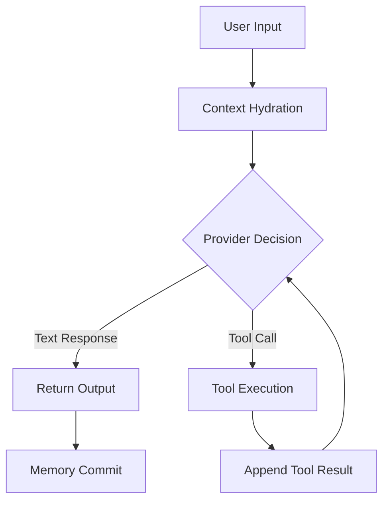
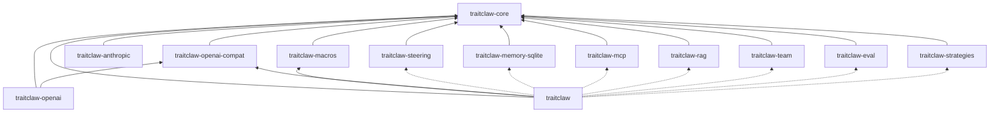

TraitClaw is built on a **layered trait architecture**. Every capability is a trait, every trait is swappable, and the framework composes them into agents.

## The Trait Stack

```
┌─────────────────────────────────────────────────────────┐
│                    traitclaw (meta-crate)                │
│  Re-exports everything. One dependency, full power.     │
├─────────────────────────────────────────────────────────┤
│  Extension Crates                                       │
│  ┌──────────┐ ┌──────────┐ ┌───────┐ ┌──────┐         │
│  │ steering │ │ sqlite   │ │ mcp   │ │ team │ ...     │
│  └──────────┘ └──────────┘ └───────┘ └──────┘         │
├─────────────────────────────────────────────────────────┤
│  Provider Crates                                        │
│  ┌──────────────┐ ┌────────────┐ ┌──────────────────┐  │
│  │ openai-compat│ │ anthropic  │ │ openai (native)  │  │
│  └──────────────┘ └────────────┘ └──────────────────┘  │
├─────────────────────────────────────────────────────────┤
│  traitclaw-core (foundation)                            │
│  Agent · Provider · Tool · Memory · Guard · Hint ·      │
│  Tracker · ContextManager · OutputTransformer ·          │
│  ExecutionStrategy · AgentStrategy · AgentHook           │
└─────────────────────────────────────────────────────────┘
```

## The 8 Core Traits

| Trait | Purpose | Example |
|-------|---------|---------|
| **`Provider`** | LLM backend | OpenAI, Anthropic, Ollama |
| **`Tool`** | Callable function | Web search, calculator |
| **`Memory`** | Conversation persistence | InMemory, SQLite |
| **`Guard`** | Safety constraint | Rate limit, shell deny |
| **`Hint`** | Guidance injection | Budget hint, system reminder |
| **`Tracker`** | Metric collection | Adaptive tracker |
| **`ContextManager`** | Context window control | Truncation, compression |
| **`OutputTransformer`** | Post-processing | JSON extraction, formatting |

Plus three orchestration traits:

| Trait | Purpose |
|-------|---------|
| **`AgentStrategy`** | Execution loop (ReAct, CoT, MCTS, Default) |
| **`AgentHook`** | Lifecycle callbacks for observability |
| **`ToolRegistry`** | Dynamic tool resolution |

## The Agent Loop

The agent's execution is a loop managed by `AgentStrategy`:



1. **Context Hydration** — Retrieve past dialogue from `Memory`, apply `ContextManager`, append user prompt
2. **Provider Generation** — LLM evaluates context, returns text or tool call
3. **Tool Resolution** — Parse arguments via `ToolRegistry`, execute Rust function, append result
4. **Recursive Reasoning** — Repeat 2–3 until the LLM decides the task is complete
5. **Output Transform** — Apply `OutputTransformer` chain
6. **Memory Commit** — Save final trajectory to `Memory`

## Dynamic Dispatch Model

TraitClaw uses a hybrid dispatch approach:

- **Static dispatch** for the hot path (agent config, builder)
- **Dynamic dispatch** (`Box<dyn Trait>`) for flexibility:
  - `Box<dyn Tool>` — heterogeneous tool collections
  - `Box<dyn Provider>` — runtime provider selection
  - `Box<dyn Memory>` — pluggable storage backends

This gives you the performance of static typing with the flexibility of runtime polymorphism — exactly where you need each.

## Crate Dependencies



*Solid lines = always included. Dotted lines = feature-gated.*
