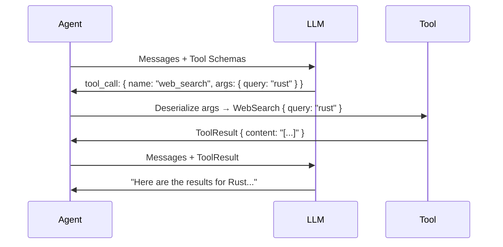

Tools are how your agent interacts with the world. TraitClaw's tool system generates JSON schemas at **compile time** from Rust structs, ensuring type safety end-to-end.

## Quick Example

```rust
use traitclaw::prelude::*;
use schemars::JsonSchema;
use serde::Deserialize;

#[derive(Tool)]
#[tool(description = "Search the web for information")]
struct WebSearch {
    /// The search query
    query: String,
    /// Maximum number of results to return
    #[serde(default = "default_max")]
    max_results: u32,
}

fn default_max() -> u32 { 5 }

#[async_trait::async_trait]
impl ToolExecute for WebSearch {
    type Output = Vec<SearchResult>;

    async fn execute(&self) -> Result<Self::Output, ToolError> {
        // Your search implementation here
        Ok(search_web(&self.query, self.max_results).await?)
    }
}
```

The `#[derive(Tool)]` macro automatically:
1. Generates a JSON schema from the struct fields and doc comments
2. Implements `ErasedTool` for type-erased storage in the agent
3. Wires up deserialization from the LLM's JSON output

## How It Works



## Tool Registries

### Static Registry (Default)

Tools added via `.tool()` are stored in a static registry:

```rust
let agent = Agent::builder()
    .tool(WebSearch)
    .tool(Calculator)
    .tool(FileReader)
    .build()?;
```

### Dynamic Registry

Add and remove tools at runtime:

```rust
use traitclaw_core::DynamicRegistry;

let mut registry = DynamicRegistry::new();
registry.register(WebSearch);
registry.register(Calculator);

// Later...
registry.deregister("web_search");
```

### Grouped Registry

Organize tools by category:

```rust
use traitclaw_core::GroupedRegistry;

let registry = GroupedRegistry::new()
    .group("search", vec![Box::new(WebSearch), Box::new(WikiSearch)])
    .group("math", vec![Box::new(Calculator)]);
```

### MCP Tool Registry

Discover tools from MCP servers automatically:

```rust
use traitclaw_mcp::{McpServer, McpToolRegistry};

let server = McpServer::stdio("npx", &["-y", "@mcp/server-filesystem", "."]).await?;
let registry = McpToolRegistry::from_server(server).await?;
// All MCP tools are now available to the agent
```
